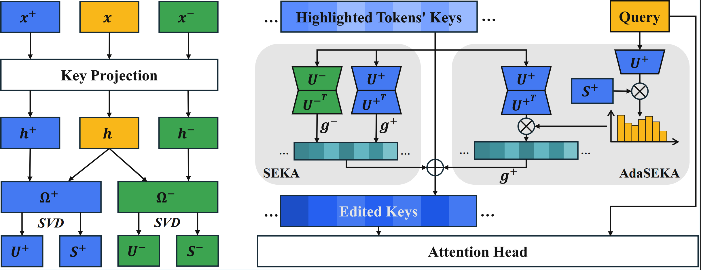

# [ICLR 2026] Spectral Attention Steering for Prompt Highlighting

<!-- Badges go here  -->

**Official implementation of the ICLR 2026 paper “Spectral Attention Steering for Prompt Highlighting” (SEKA & AdaSEKA)** by *Weixian Waylon Li, Yuchen Niu, Yongxin Yang, Keshuang Li, Tiejun Ma,* and *Shay B. Cohen*.

---

## 📣 News
- **[Feb 2026]** Initial codebase and datasets released.
- **[Jan 2026]** We're excited to announce that our paper has been accepted to **ICLR 2026**! 🎉

---
- [Key ideas](#key-ideas)
- [Repo layout](#repo-layout)
- [Quick start](#quick-start)
  - [1. Environment](#1-environment)
  - [2. Projections (SEKA & AdaSEKA)](#2-projections-seka--adaseka)
  - [3. Run a benchmark](#3-run-a-benchmark)
- [Reproducing paper results](#reproducing-paper-results)
- [Citation](#citation)

---

## Key ideas

- **SEKA** – Learn low-rank projections from synthetic QA pairs and inject them into attention keys during inference (via `SEKALLM`).
- **AdaSEKA** – Maintain a small ensemble of SEKA experts plus an expert selector (`AdaptiveSEKALLM`) that chooses the best projection for each input.



## Repo layout

```
SEKA/
├── adaptive-seka-config/       # Example AdaSEKA expert configs (JSON templates)
├── benchmarks/                 # Evaluation drivers + utilities (see benchmarks/README.md)
├── notebook/                   # Analysis / plotting notebooks
├── pastalib/                   # PASTA steering library (used for comparisons)
├── scripts/                    # Bash helpers for projection building & evaluation
├── src/                        # Core SEKA / AdaSEKA implementation
├── requirements.txt            # Minimal dependencies
└── requirements-complete.txt   # Full environment (paper reproduction)
```

## Quick start

### 1. Environment
```bash
conda create -n seka python=3.10 -y
conda activate seka
pip install -r requirements.txt
```
### 2. Prepare the datasets

Grab the preprocessed datasets bundle from Hugging Face (<https://huggingface.co/datasets/waylonli/SEKA-datasets>) and unpack it at the repo root so the `data/` directory matches the paths used below.

### 3. Projections (SEKA & AdaSEKA)

1. **SEKA projections** – Generate with the builders in `src/custom_builders/`, e.g.
   ```bash
   python src/custom_builders/synthetic_qa_builder.py \
     --model pretrained/Qwen3-4B-Base \
     --data data/synthetic/pair_qa_new.jsonl \
     --output_dir seka_projections/biasbios/Qwen3-4B-Base \
     --max_samples 200 \
     --min_diff 0.20 \
     --top_pct 0.90
   ```

2. **AdaSEKA projections & config**
   1. Build one expert projection per steering expert with the adaptive builder (save the SVD components that AdaSEKA consumes):
      ```bash
      python src/custom_builders/adaptive/synthetic_qa_builder_adaptive.py \
        --model pretrained/Qwen3-8B-Base \
        --data data/synthetic/pair_qa_new.jsonl \
        --output_dir projections/adaptive/biasbios \
        --max_samples 200 \
        --min_diff 0.20 \
        --top_pct 0.90 \
        --save-svd --svd-only
      ```
      Repeat the same command for each expert you need (e.g. change `--output_dir` to `projections/adaptive/counterfact`, `.../pronchange`, etc.).
   2. Copy a template from `adaptive-seka-config/` and edit it to reference your tensors:
      ```bash
      cp adaptive-seka-config/Qwen3-8B/Qwen3-8B-mindiff-0.2.json adaseka_config.json
      ```
      The config is a flat `{expert: projection_path}` mapping, e.g.
      ```json
      {
        "biasbios": "projections/adaptive/biasbios/Qwen3-8B-Base_0.2mindiff_pos_svd.pt",
        "counterfact": "projections/adaptive/counterfact/Qwen3-8B-Base_0.2mindiff_pos_svd.pt",
        "pronchange": "projections/adaptive/pronchange/Qwen3-8B-Base_0.2mindiff_pos_svd.pt",
        "synthetic": "projections/adaptive/synthetic/Qwen3-8B-Base_0.2mindiff_pos_svd.pt"
      }
      ```
      These keys must match the experts you supply at inference time.
   3. Enable AdaSEKA with `--adaptive-seka` and point to the config via `--adaptive-expert-path adaseka_config.json` when you launch an evaluation.

### 4. Run a benchmark

Bracketed parameters in the examples below are placeholders—set `[AMP_POS]`, `[AMP_NEG]`, and `[ADAPTIVE_FACTOR]` to your chosen amplification strengths before running.

#### SEKA example (BiasBios — positive + negative projections)
```bash
python benchmarks/eval_bias_gen.py \
  --model pretrained/Qwen3-4B-Base \
  --data_path data/biasbios/biasbios.json \
  --output_dir benchmarks/biasbios/results/seka-qwen3-4b \
  --overwrite_output_dir \
  --batch_size 32 \
  --max_new_tokens 64 \
  --seka \
  --pos seka_projections/biasbios/Qwen3-4B-Base_pos_proj.pt \
  --neg seka_projections/biasbios/Qwen3-4B-Base_neg_proj.pt \
  --amplify_pos [AMP_POS] \
  --amplify_neg [AMP_NEG] \
  --layers last10
```

#### AdaSEKA example (CounterFact — adaptive experts)
```bash
python benchmarks/eval_fact_gen.py \
  --model pretrained/Qwen3-8B-Base \
  --data_path data/counterfact \
  --output_dir benchmarks/counterfact/results/adaseka-qwen3-8b \
  --overwrite_output_dir \
  --benchmarks efficacy paraphrase \
  --add_unmediated_fact True \
  --batch_size 32 \
  --max_new_tokens 64 \
  --adaptive-seka \
  --adaptive-expert-path adaseka_config.json \
  --adaptive_amplify_factor [ADAPTIVE_FACTOR] \
  --layers last10
```

## Reproducing paper results

Detailed instructions live in [`benchmarks/README.md`](benchmarks/README.md):
1. Prepare the BiasBios / CounterFact / PronChange datasets.
2. Download the SEKA and AdaSEKA projection packs (links above) or regenerate them.
3. Run the provided bash commands to reproduce the tables from the paper.

Each run writes `metric_result.json` and `sweep_config.json` for traceability.

## Citation

```bibtex
@inproceedings{
    li2026spectral,
    title={Spectral Attention Steering for Prompt Highlighting},
    author={Weixian Waylon Li and Yuchen Niu and Yongxin Yang and Keshuang Li and Tiejun Ma and Shay B. Cohen},
    booktitle={The Fourteenth International Conference on Learning Representations},
    year={2026},
    url={https://openreview.net/forum?id=XfLvGIFmAN}
}
```
